# Ravindra Siva Sai Kumar Medicharla

### ML & AI Engineer · Applied AI · LLM Evaluation

**Building production-ready machine learning systems — from model to deployed endpoint.**

---

## About

I build machine learning and applied AI systems end to end — training, explainability, serving, and deployment. My work spans deep learning, generative AI, LLM and agent evaluation, explainable AI, and computer vision.

Currently an **AI Trainer at Handshake AI**, working on LLM and agent evaluation, prompt engineering, and human feedback workflows. I also publish AI guides and whitepapers under **SSK AI Hub™**.

**Open to:** Machine Learning Engineer · Applied AI Engineer · Generative AI Engineer · AI Engineer

---

## Tech Stack

**Languages & Core**

**ML, Deep Learning & GenAI**

**Serving, Infra & Tooling**

**Frontend (for ML products)**

---

## Featured Projects

<table>
<tr>
<td width="50%" valign="top">

### MediTrust
Explainable cardiovascular risk platform. Per-prediction SHAP explanations and Gemini-generated clinical summaries, served through a FastAPI backend on AWS EC2.

**Stack:** Python · FastAPI · SHAP · Gemini · PostgreSQL · AWS
**Result:** ROC-AUC 0.97

<!-- TODO: add live demo URL if deployed, else leave as is -->

</td>
<td width="50%" valign="top">

### GunData — Agentic AI
<!-- TODO: 2 lines on what the agent actually does — its decision loop, the tools it calls, why it's interesting -->

**Stack:** Java · Agentic AI
**Result:** <!-- TODO -->

</td>
</tr>
<tr>
<td width="50%" valign="top">

### PhishGuard
Phishing email detector that classifies malicious intent from raw email text, deployed as an interactive Streamlit app.

**Stack:** Python · scikit-learn · Streamlit
**Result:** <!-- TODO: accuracy or F1 -->

</td>
<td width="50%" valign="top">

### SnapTune
Multimodal recommender that reads the mood of an image and maps it to matching Spotify tracks.

**Stack:** Hugging Face · Spotify API · Streamlit

</td>
</tr>
</table>

> **SSK AI Hub™** — my Next.js portfolio and AI publishing platform, live at [ravindrassk.com](https://ravindrassk.com) · [source](https://github.com/RavindraSSK/ravindra-ssk-site)

---

## Currently Exploring

---

## Certifications

---

## GitHub Activity

  

  

---

## Get In Touch

Open to ML & AI engineering roles starting **December 2026**, and to research or open-source collaboration.

  

SSK AI Hub™ · Learn • Build • Innovate

